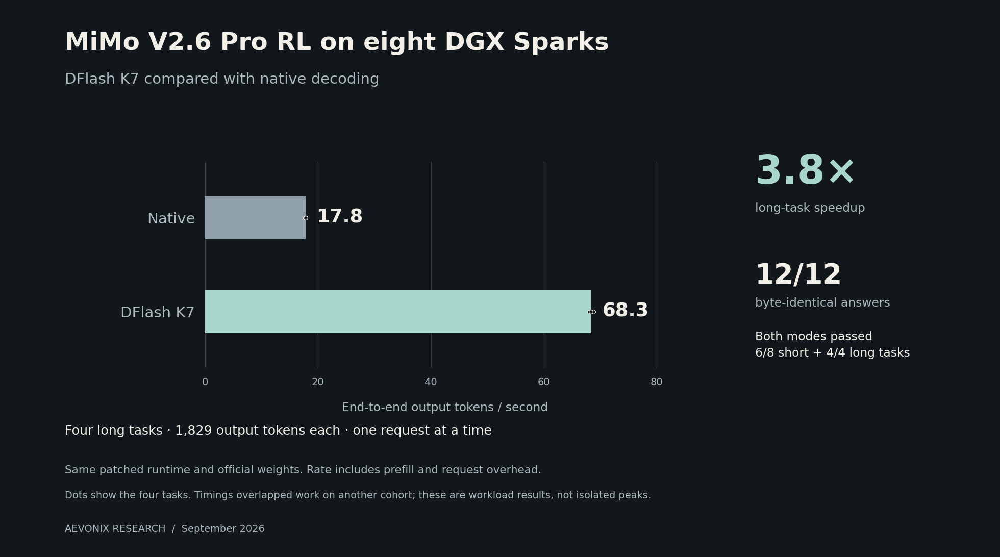

# MiMo 2.6 on DGX Spark

Aevonix's experimental serving recipe for **MiMo V2.6 Pro RL on eight DGX Sparks**. Includes the runtime patches, DFlash configuration, build source and test results.



The comparison uses the **same patched runtime**, with DFlash off and on. These are four long structured-output tasks, not a general speed guarantee or a comparison against stock vLLM.

A subsequent mixed structured-output workload caused a fatal CUDA error. The cause is under investigation; this recipe is not yet qualified for unattended production. See [the incident note](docs/results.md#subsequent-runtime-failure).

## Model

- [Official XiaomiMiMo weights](https://huggingface.co/XiaomiMiMo/MiMo-V2.6-Pro-RL)
- [Pinned snapshot](https://huggingface.co/XiaomiMiMo/MiMo-V2.6-Pro-RL/tree/73875d00b30a89ef8cc353a0b60b0e9f9561952d), including the [DFlash draft](https://huggingface.co/XiaomiMiMo/MiMo-V2.6-Pro-RL/tree/73875d00b30a89ef8cc353a0b60b0e9f9561952d/dflash)

No model weights are included or modified. This package targets the official checkpoint only.

## Tested scope

| Check | Observed result |
| --- | --- |
| Hardware | 8 × DGX Spark, GB10/SM121, TP8 with expert parallelism |
| Long-context extraction | 257,531 input tokens; correct answer |
| Mixed workload | Four simultaneous requests; 4/4 correct |
| API contracts | 4/4 schema and tool-call checks; no tools executed |
| Modalities | Text only |

The frozen tasks include two model mistakes shared by both modes. Output agreement does not mean every answer was correct. See [results and limits](docs/results.md) for task-level timings, context latency and methodology.

## Run

Requires eight idle Sparks with working RoCE v2, Docker/NVIDIA Container Toolkit, and the same complete pinned model snapshot available on every host. Interface names, addresses and storage paths are yours to supply.

```sh
git clone https://github.com/Aevonix/mimo-2.6-dgx-spark.git
cd mimo-2.6-dgx-spark
python3 scripts/check_release.py
docker build --platform linux/arm64 -t mimo-spark:20260923 .
cp config/cluster.example.json cluster.json
```

Edit `cluster.json`. Make the image and configuration available on each host. Preview the command, then start the corresponding rank on each Spark, using ranks **0 through 7**:

```sh
python3 scripts/launch.py --rank 0
python3 scripts/launch.py --rank 0 --execute
```

The launcher never stops another workload. [Setup](docs/setup.md) covers downloads, networking, native comparison and local checks. [Source and build notes](docs/build.md) explain the patches and included kernel binary.

The mounted runtime bundle was tested on our cluster. This generic packaging and launcher have local checks, but have not yet been repeated on an independent cluster. Configured 1M context and 16 scheduler slots are **not validated capacities**. Treat changes to hardware, weights or runtime version as a new configuration to test.

## Credits

Apache-2.0 runtime changes based on [vLLM](https://github.com/vllm-project/vllm), Marlin and [bxchange's token-order patch](https://github.com/vllm-project/vllm/pull/52532). Full attribution: [NOTICE](NOTICE.md). Model licensing remains with XiaomiMiMo. This is an independent Aevonix project.
